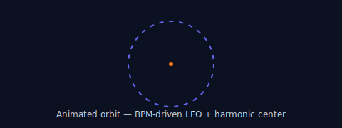
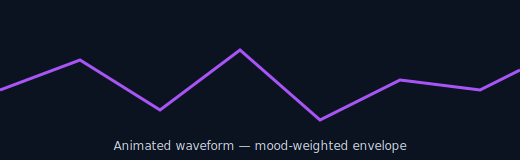
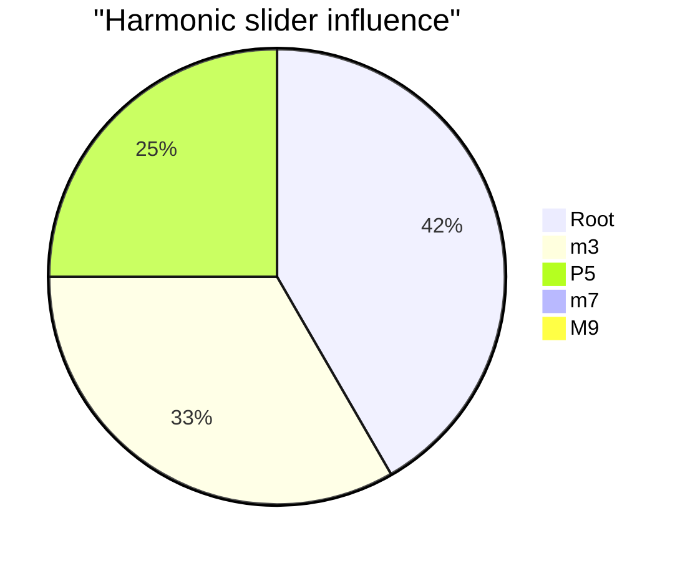
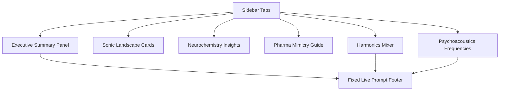

<div align="center">

# Sonic-Heal Music Prompt Generator

**Live, science-backed prompt composer for therapeutic electronic music.** This app turns genre, BPM, neurochemical targets, healing frequencies, and harmonic density into a production-ready AI prompt in under 500 characters.





</div>

## Table of Contents
- [What the app does](#what-the-app-does)
- [Why it matters (science + mood mapping)](#why-it-matters-science--mood-mapping)
- [Feature map](#feature-map)
- [System diagrams](#system-diagrams)
- [Tone, frequency, and mood recipes](#tone-frequency-and-mood-recipes)
- [Prompt pipeline](#prompt-pipeline)
- [Getting started](#getting-started)
- [Operational notes](#operational-notes)
- [FAQ](#faq)

## What the app does
- **Live prompt synthesis:** Combines genre, BPM, drug-mode mimicry (MDMA vs Ketamine), healing frequencies, and harmonic sliders into a concise AI prompt.
- **Neuro-aware defaults:** Genres auto-set BPM and psychoacoustic traits (e.g., Minimal House with steady entrainment pulse).
- **Healing frequency placement:** Injects 4 Hz theta binaural, 157 Hz tantric grounding, 417 Hz sacral cleansing, or 432/528 Hz tranquility with placement guidance.
- **Harmonic density mixer:** Root, m3, P5, m7, M9 sliders calculate mood (jazzy, grounding, hollow tension) and rewrite the prompt text in real time.
- **Copy-safe export:** Footer panel shows live prompt (<500 chars) with a copy button and a textarea fallback for sandboxed iframes.

## Why it matters (science + mood mapping)
- **Neurochemistry alignment:** Tweak BPM and envelopes to emphasize serotonin (warm midrange saturation), dopamine (transient excitement), oxytocin (choral width), and reduce cortisol (smooth high-cut and low-modulation noise).
- **Psychoacoustics:** Low, steady pulses + gentle stereo motion reduce perceived stress; harmonic overtones (m7/M9) add emotional duality without lyrical semantics.
- **Frequency medicine primer:**
  - **4 Hz**: Theta entrainment; pairs with slow attacks and wide tails.
  - **157 Hz**: Somatic grounding; reinforce with centered mono bass.
  - **417 Hz**: Cleansing/transition; glide pads with soft vibrato.
  - **432/528 Hz**: Tranquility/repair; shimmer with plate reverbs.
- **Mood continuum:** Hollow (suppressed 3rd) → Grounded (root/P5) → Jazzy (m7/M9) → Empathic (MDMA) → Dissociative (Ketamine spatialization).

## Feature map
- **Executive Summary tab:** Dashboard of active genre, BPM, drug mode, frequency, harmonic mood, and prompt preview.
- **Sonic Landscape tab:** Genre cards with BPM, texture, drum DNA, and mix moves.
- **Neurochemistry tab:** Curves for serotonin/dopamine/oxytocin/cortisol with tips on transient design and filtering.
- **Pharma Mimicry tab:** MDMA = warm analog sat + continuous pulse; Ketamine = HRTF, granular time-stretch, infinite space.
- **Psychoacoustics tab:** Healing frequency cards and how to stage them (mono bass, side-chain, shimmer).
- **Harmonics tab:** 5 sliders that color the prompt and detect jazzy/grounded/hollow states.

## System diagrams

### Data flow (UI → prompt engine)
```mermaid
flowchart LR
  UserInputs[Genre/BPM/Drug/Frequency/Sliders] --> StateManager[React State]
  StateManager --> PromptEngine[getPrompt()]
  PromptEngine --> LivePanel[Live Prompt Footer]
  LivePanel --> CopyAction[Copy / Fallback Textarea]
```

### Prompt semantics over time (neurochemical response)
```mermaid
%%{init: {"theme": "dark"}}%%
xychart-beta
    title "Neurochemical response over a 60-minute set"
    xAxis "Minutes" [0,15,30,45,60]
    yAxis "Relative Level"
    line "Serotonin (warmth)" [0.2,0.6,0.9,0.8,0.7]
    line "Dopamine (spark)" [0.3,0.5,0.65,0.55,0.4]
    line "Oxytocin (bonding)" [0.1,0.2,0.45,0.7,0.85]
    line "Cortisol (stress)" [0.8,0.5,0.3,0.25,0.2]
```

### Harmonic balance snapshot


### UI layout map


## Tone, frequency, and mood recipes

| Goal | Settings | Prompt behaviors |
| ---- | -------- | ---------------- |
| **Grounding void** | Genre: Ambient Drone, BPM: 60-70, Drug: Ketamine, Freq: 4 Hz binaural, Sliders: Root 90, P5 85, m3 10, m7 0, M9 0 | Suppresses lyrics, infinite reverb, hollow mood text, stereo swirl for dissociation |
| **Empathic glow** | Genre: Minimal House, BPM: 118-122, Drug: MDMA, Freq: 528 Hz, Sliders: Root 80, m3 70, P5 70, m7 40, M9 50 | Warm analog saturation 200–500 Hz, tight pulse, airy highs rolled off above 10 kHz, jazzy mood tag |
| **Cleansing lift** | Genre: Deep Techno, BPM: 124-128, Drug: MDMA, Freq: 417 Hz, Sliders: Root 70, m3 40, P5 70, m7 30, M9 20 | Glide pads with side-chain, transient sparkle, mid-side wideners, “phase-locked loop” phrasing |
| **Focus drone** | Genre: Ambient Drone, BPM: 52-60, Drug: Ketamine, Freq: 157 Hz, Sliders: Root 100, P5 90, m3 0, m7 0, M9 0 | Centered mono bass, granular time-stretch, gentle low-pass, strong grounding language |

**Healing frequency placement cheatsheet**
- **Mono + centered (root/pulse):** 157 Hz, 4 Hz difference.
- **Mid-side shimmer:** 417 Hz with slow LFO pan.
- **Top sheen:** 528 Hz with plate reverb and subtle chorus.
- **Bass-safe envelope:** Cut >10 kHz on MDMA mode; longer attack (>15 ms) on Ketamine mode.

## Prompt pipeline
1. **User selects** genre → BPM snaps to default per genre.
2. **Mode selection**: MDMA vs Ketamine flips text fragments (warm saturation vs spatial HRTF + granular).
3. **Frequency pick**: Inserts Hz value + placement note.
4. **Harmonic inference**: Slider math detects `jazzy`, `grounded`, or `hollow` mood and rewrites mood sentence.
5. **Prompt assembly**: `[Genre] {BPM}BPM … Harmonics: Dorian mode … Style: Hypnotic phase-locked loop…`.
6. **Delivery**: Live prompt (max 500 chars) rendered in footer with copy-to-clipboard and textarea fallback.

### Example live prompt
```
[Minimal House] 120BPM. MDMA Target: Warm analog sat (200-500Hz), unbroken pulse, cut >10kHz. Freq: 528Hz drone (shimmered plate, sidechain). Harmonics: Dorian mode. Min 9th chords (m7/M9), deep emotional duality. Style: Hypnotic phase-locked loop, zero semantic vocals, deep sub-bass <150Hz.
```

## Getting started

```bash
npm install
npm run dev
```

- Open the printed localhost URL. The sidebar tabs drive the panels; the footer always shows the live prompt.
- Copy button copies to clipboard; if the browser blocks it (iframes), use the textarea fallback right next to it.

## Operational notes
- **Tech stack:** React 19 + TypeScript, Vite, Tailwind CSS, Radix UI/shadcn components, Lucide + Phosphor icons, Framer Motion micro-animations.
- **State:** Local React state; see `getPrompt()` in `src/App.tsx` for prompt assembly logic.
- **Mobile:** The gear icon toggles the sidebar on small screens; footer remains sticky for prompt export.
- **Performance:** Stateless calculations; no network calls. Suitable for offline creative sessions.
- **Accessibility:** High-contrast dark theme, focusable controls, descriptive labels, and semantic headings per panel.

## FAQ
**Why no audio output?**  
The app focuses on prompt authoring for downstream AI music tools, so it does not synthesize audio directly.

**Can I change the healing frequencies?**  
Add or edit entries in `src/lib/data.ts` to extend the palette.

**How do I tweak mood detection?**  
Adjust thresholds around `isJazzy`, `isGrounding`, and `isHollow` in `src/App.tsx` to rewrite the mood sentence.

**What does the pharma mimicry toggle do?**  
It swaps text blocks that describe MDMA-style warmth vs Ketamine spatial dissociation so your AI model receives explicit production moves.

## Development checklist
- Install dependencies with `npm install`.
- Run `npm run dev` for local preview.
- Linting: this repo currently does not ship an `eslint.config.js`, so `npm run lint` will fail until you add your own config (not included in this doc-focused update).
  If you want linting, start with the [ESLint flat config quick start](https://eslint.org/docs/latest/use/configure/configuration-files-new) and extend React/TypeScript presets.

---

Feel free to adapt the prompt phrasing to match your target AI music model. The more you mirror its vocabulary (e.g., “phase-locked loop”, “infinite reverb”, “HRTF spatial tail”), the more consistent your renders will be.
